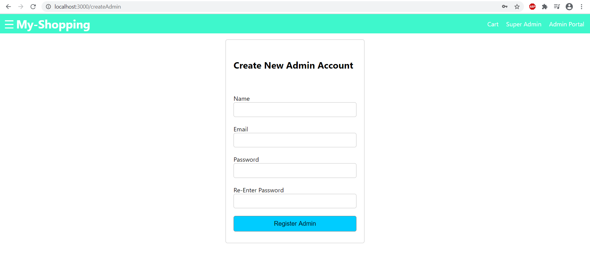

# Shopping Site
A fully functional shopping website using Node.js and ReactJS.
# Running Locally
1. Clone this repo
2. cd Shopping-Site
3. cd backend 
4. npm install
5. npm start
6. Open new terminal
7. cd frontend
8. npm install
9. npm start
# Techstack
1. HTML5 and CSS3
2. ReactJS for frontend development
3. Redux for state management
4. Node.js for handling the server side
5. MongoDB as the Database
# Types of Accounts
1. Admin : Can add, delete and edit products.
2. Superadmin : Superadmin can do three things - a) Can add, delete and edit products, b) Can add new admins or remove existing admins, c) Can remove existing users.
3. Users : Can purchase products.
# Creating a Superadmin account
Once the backend server is running, go to "localhost:5000/api/users/createadmin", note down the superadmin credentials. Use the credentials to log in into the site and start adding products or admins.
# Superadmin Actions
1. Adding New Products

2. Editing and Deleting Existing Products

3. Adding Admins 

4. Deleting Existing Admins 

5. Deleting Existing Users

# Admin Actions
1. Adding New Products

2. Editing and Deleting Existing Products.

# Mockups
1. Homepage

2. Individual Product

Users can also zoom in by moving the cursor over the image to get a detailed look at the product.

3. Product Filter Options

There are four filter options : 
1) Category Based - This lets the user choose specific category i.e. Shirts, Pants, Mobiles etc
2) Search by Keyword - User can search products by their name i.e. Slim Shirt, Smartphones etc.
3) Select Price Range - User can pick the price range according to his/her budget.
4) Sort By - This lets the user to sort the products based on three options a) Low to High Price, b) High to Low Price, c) Newest Arrivals.

4. Registration

5. Log In

6. Add To Cart 

7. Shipping Address

8. Payment Options

9. Review Your Order before placing

10. Proceed with Payment

11. Order History 

